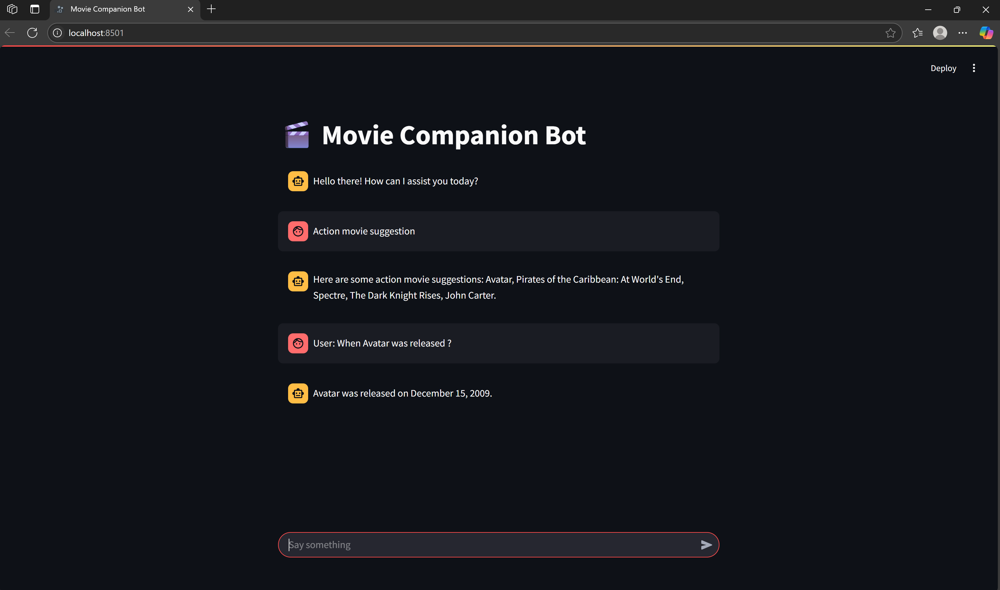

# 🎬 Movie Companion Bot

Movie Companion Bot is a smart  chatbot that combines a **Recommendation system** with an **AI agent**.

One can chat with it to get movie suggestions, movie details, find popular movies, or explore films by genre. It's built using LangChain, ML, TMDb API, and Streamlit for a fun and interactive experience.

The recommendation system is built using **scikit-learn** and trained on the TMDb Kaggle dataset. It uses cosine similarity to find and suggest movies similar to the one the user mentions.

This system is then integrated as a custom tool with other tools into a **LangChain AI agent**, allowing the bot to smartly decide when to use the recommendation engine, fetch genre-based results, or provide popular movie suggestions. 




___

# 🚀 Features


* 🎥 Get movie recommendation based on movie title & genre

* 🔥Get Top Popular movies

* 🌐 Web search via DuckDuckGo for external info

* ℹ️ Get detailed information about any movie

* 🧠 Memory-enabled conversational experience

* 💬 Streamlit-based interactive chatbot UI

# ⚙️ Setup Instructions

**1. Clone the repo**

```bash 
git clone https://github.com/BhagwatiOracle/Movie-Companion-Bot.git

cd movie-companion-bot

```
**2. Create virtual environment**
```bash
python -m venv venv

venv\Scripts\Activate
```
**3. Install dependencies**

```bash
pip install -r requirements.txt
```

**4. Groq API Key**

* Go to https://console.groq.com/keys?ref=zinyando.com

* Sign up and get your API key

* Add it to a .env file:
```env
GROQ_API_KEY=your_api_key
```

**5. TMDB_API_KEY**

* Go to https://www.themoviedb.org

* Sign up and get your API key

* Add it to a .env file:

```
TMDB_API_KEY=your_api_key_here
```

**6. Run the app**
```
streamlit run App.py
```

# 🤝 Contribution
Contributions are welcome! Please fork the repo, make changes, and open a pull request. Feel free to open issues for bugs or suggestions.
